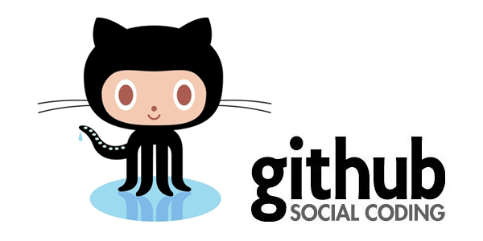
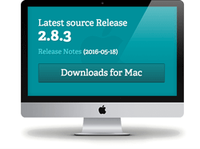
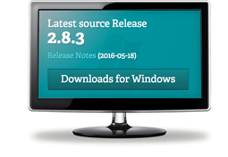
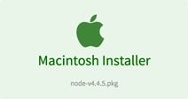
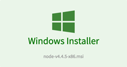

# Welcome to Bootcamp 1

### Sign up for Github

* [Github](http://github.com)
    * Sign up for a new account
    * Already have an account? Perfect!
    * Join the Geekwise-Bootcamp-1 Organization
        * From within the organization:
        * Click the  button
        * In the Repository Name input box, type your Github username (lowercase please)
        * Check the  checkbox
        * Click the  button


### Items to download
* [Git](http://git-scm.com/)
    * __Mac__ - download and install  
    
    * __Windows__ - download and install  
    
* [Node.js](http://nodejs.org/en/download/)
    * __Mac__ - download and install  
    
    * __Windows__ - download and install  
    
        * [Install Visual C++ Build Tools](http://go.microsoft.com/fwlink/?LinkId=691126)
        * [Install Python 2.7 (v3.x.x is NOT supported)](https://www.python.org/downloads/)
        * Launch Bash and run ``` npm config set msvs_version 2015 ```
* [Github Desktop](http://desktop.github.com)
    * __Mac__ - download and install  
    
    * __Windows__ - download and install  
    
* [Atom](http://atom.io/)
    * Emmet (emmet)
    * Atom Beautify (atom-beautify)
    * Auto Close HTML (autoclose-html)
    * Auto Complete Paths (autocomplete-paths)
    * Highlight Selected (highlight-selected)
    * MiniMap (minimap)
    * MiniMap Highlight Selected (minimap-highlight-selected)
    * Open In Browser (open-in-browser)
    * Open Recent (open-recent)
    * Pigments (pigments)
    * Terminal (platformio-ide-terminal) settings: __Shell Override: C:\Program Files\Git\bin\bash.exe__
